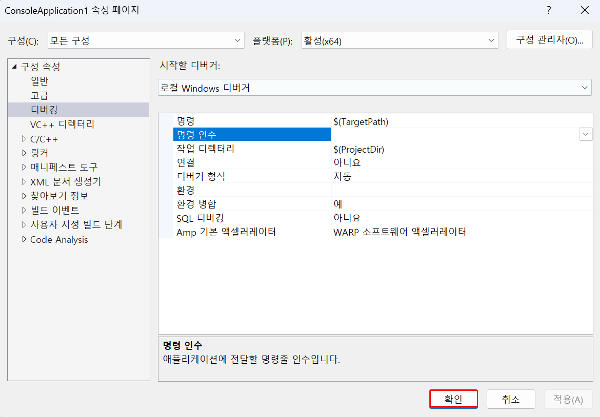

# 윈도우에서 OpenCV 사용하기

 이 포스트는 윈도우에서 VS를 활용하여 OpenCV를 설치하고 사용하는 방법을 다룹니다.

## 1. OpenCV 설치
 [OpenCV 다운로드 페이지](https://opencv.org/releases/)에서 최신 릴리즈의 Windows용 OpenCV 라이브러리를 다운로드합니다.

## 2. 개발 환경 설정
### 2-1.환경 변수 설정
 우선 시스템의 환경 변수에 (드라이브명)openvcv\bulid\x64\vc16\bin을 추가해 주어야 합니다.
 
 
 
 
 
 

 
 
 
 
 
 
 
 
 
 

## 3. 샘플 코드 실행하기
 opencv\sources\samples\cpp\edge.cpp를 한번 실행해보죠.
 해당 코드는 main함수에서 인자를 받도록 설정되어 있으므로, 프로젝트 속성의 구성 속성에서 샘플 사진 경로를 추가해 주어야 합니다.

 
 