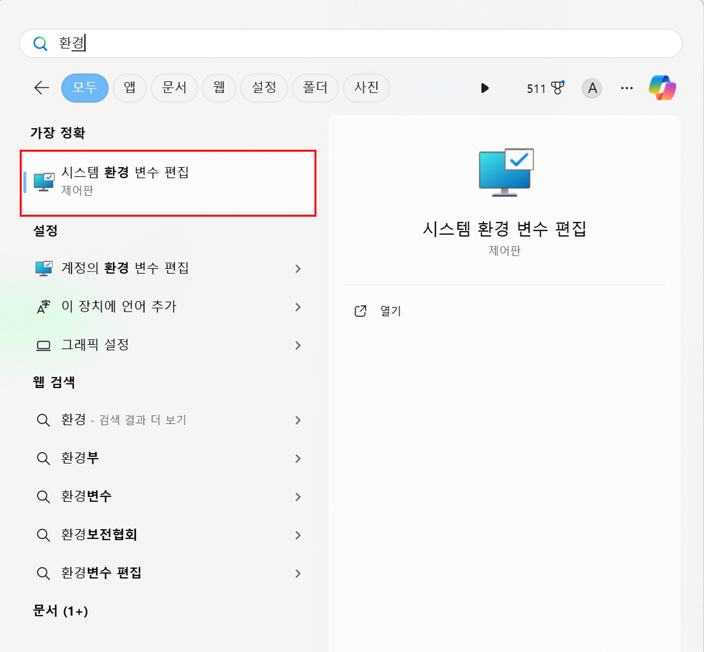

# 윈도우에서 OpenCV 사용하기

 이 포스트는 윈도우에서 VS를 활용하여 OpenCV를 설치하고 사용하는 방법을 다룹니다.

## 1. OpenCV 설치
 [OpenCV 다운로드 페이지](https://opencv.org/releases/)에서 최신 릴리즈의 Windows용 OpenCV 라이브러리를 다운로드합니다.
 실행 파일을 실행하고, 경로를 설정한 뒤 Extract를 눌러주면 설치가 완료됩니다.
 다만 사용하기 위해선 별도의 설정이 필요합니다. 아래 설정을 따라주세요.

## 2. 개발 환경 설정
### 2-1. 환경 변수 설정
 우선 시스템의 환경 변수에 (드라이브명)openvcv\bulid\x64\vc16\bin을 추가해 주어야 합니다.
 
 
 윈도우 키를 누르고 '환경변수'를 검색한뒤, '환경 변수 편집'을 클릭합니다.
 
 
 시스템 속성에서 '환경 변수'를 클릭합니다.

 
 '시스템 변수'의 'Path'를 더블클릭합니다.

 
 '새로 만들기'를 클릭하고 "(드라이브명)openvcv\bulid\x64\vc16\bin"을 추가합니다.
 경로가 입력되었으면 확인을 누릅니다.

 
 마찮가지로 확인을 누릅니다.

 
 마지막으로 확인을 누릅니다.

 이제 환경 변수 설정이 끝났습니다. EZ.

### 2-2. 프로젝트 설정
 환경 변수 설정을 훌륭히 끝마치신것을 축하합니다.
 하지만 아직 더 설정해야 할 부분이 남았습니다.
 이제 VS에서 새 프로젝트->콘솔 앱을 선택합니다.
 프로젝트가 생성되었으면 프로젝트의 설정을 시작합니다.

 
 솔루션 탐색기에서 프로젝트 이름을 우클릭합니다.

 
 속성을 선택합니다

 
 C/C++->일반->추가 포함 디렉터리를 클릭해 <편집...>을 클릭합니다.

 
 더블클릭하면 나오는 ...을 클릭한 뒤 "(드라이브명)opencv\build\include"를 추가합니다.
 확인을 누릅니다.

 
 링커->일반->추가 라이브러리 디렉터리를 클릭하여 편집합니다.

 
 더블클릭하면 나오는 ...을 클릭한 뒤 "(드라이브명)opencv\build\x64\vc16\bin"을 추가합니다.(해당 경로는 64bit 시스템 기준입니다.)
 

 
 링커->입력->추가 종속성을 클릭합니다.

 
 사용하려는 OpenCV모듈에 맞는 .lib파일들을 추가해줍니다.
 전 'opencv_world490d.lib'를 추가하겠습니다.('d'접미사가 붙은 경우 디버그 모드에서 활용 가능함을 나타냅니다)
 확인을 누릅니다.

 
 확인을 누릅니다. 프로젝트 설정을 훌륭히 마치셨습니다. 잘하셨어요.

## 3. 샘플 코드 실행하기
 opencv\sources\samples\cpp\edge.cpp를 한번 실행해보죠.
 해당 파일을 프로젝트의 소스 파일에 추가합니다.

 해당 코드는 main함수에서 인자를 받도록 설정되어 있으므로, 프로젝트 속성의 구성 속성에서 샘플 사진 경로를 추가해 주어야 합니다.[pixabay](https://pixabay.com/photos/)등의 사이트에서 무료 이미지를 다운받은 뒤  프로젝트 설정으로 들어갑니다.

 
 구성속성->디버깅->명령 인수를 클릭합니다. 
 테스트용 이미지 파일의 경로를 입력합니다.
 확인을 누릅니다.

 
 확인을 누른 뒤 실행해봅시다.

제가 사용한 이미지는 [이곳](https://www.pickpik.com/new-york-usa-manhattan-taxi-auto-road-116059)에서 다운로드 받았습니다.

실행 전

실행 후

아주 잘 된것을 확인할 수 있습니다. 하나 더 해볼까요?
전 detect_mser.cpp를 실행해보겠습니다. 이미 설정이 전부 되어 있으므로, 소스 파일을 추가하고 edge.cpp를 빌드에서 제외한 뒤, 실행만 하면 됩니다.

실행 결과

잘 된거..일까요? 좀 더 공부해봐야겠군요. 포스팅을 봐주셔서 감사합니다.