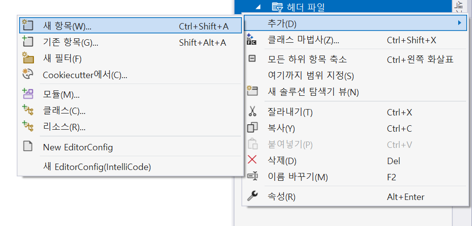
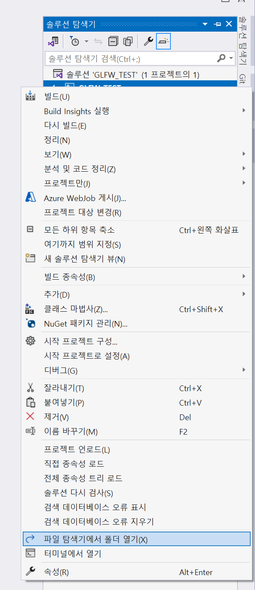
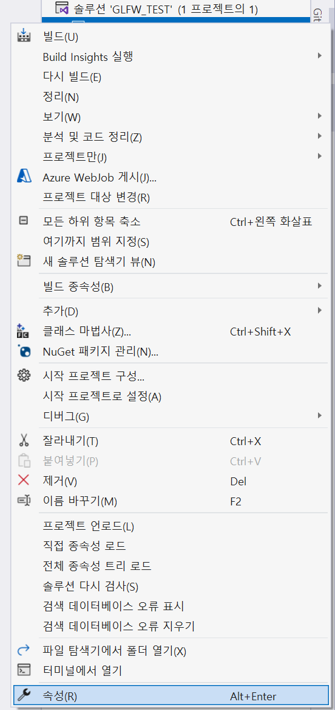
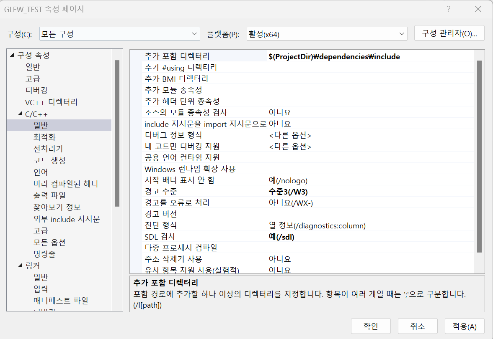
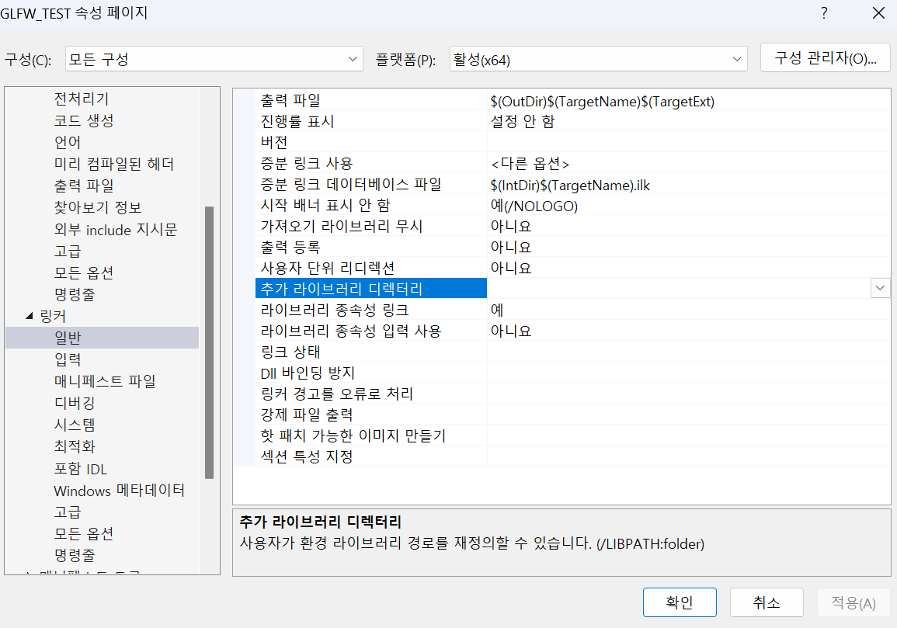
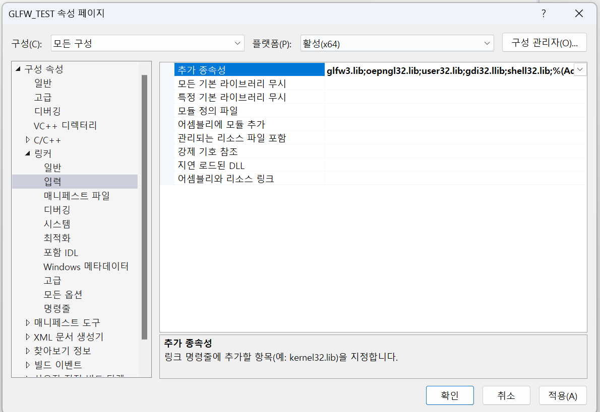
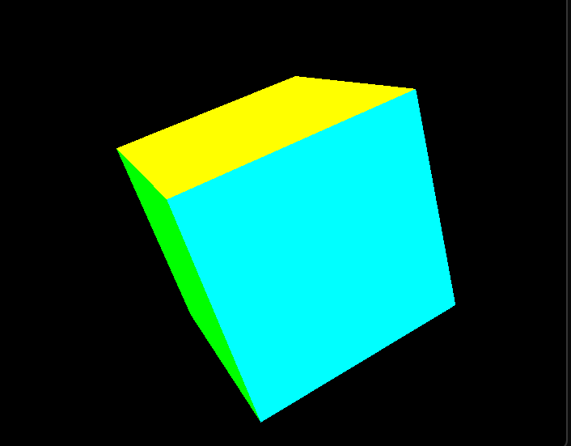

GLFW는 OpenGL, Vulkan등의 라이브러리와 상호작용하는 기능을 제공하는 라이브러리입니다..<br/>
이 포스트에선 윈도우에서 Visual Studio를 통해 c++과 GLFW를 연동해 보겠습니다.<br/><br/>

[여기](https://www.glfw.org/)에서 상단의 Download로 들어간 뒤 64-bit Windows binaries를 다운로드합니다.<br/>
원하는 경로에 압축 해제 해주면, 준비물은 끝났습니다.<br/>

## 프로젝트 만들기
이제 Visual Studio를 활용해 프로젝트를 생성하겠습니다.<br/>

Visual Studio에서 새 프로젝트 만들기>빈 프로젝트를 선택합니다. 프로젝트 이름을 원하는 대로 설정하고 만들기를 누릅니다.<br/>

그런 다음 솔루션 탐색기에 우클릭>추가>새 항목을 선택합니다.<br/>
<br/>

파일명과 확장자를 입력합니다. 전 파일명을 cpuboid.cpp로 하겠습니다. 파일 명은 편한대로 하셔도 되지만, 아래 예제를 실행하기 위해선 .cpp확장자로 생성해주세요.<br/> (윈도우에서 c++파일의 확장자는 cpp입니다)<br/>
<br/>


예제 코드<br/>
```cpp
#include <GLFW/glfw3.h>
#include <GL/gl.h>
#include <cmath>
#include <cstdlib>
#include <cstdio>

static void error_callback(int error, const char* description) {
  fprintf(stderr, "Error: %s\n", description);
}

static void key_callback(GLFWwindow* window, int key, int scancode, int action, int mods) {
  if (key == GLFW_KEY_ESCAPE && action == GLFW_PRESS)
    glfwSetWindowShouldClose(window, GLFW_TRUE);
}

void customPerspective(GLdouble fovy, GLdouble aspect, GLdouble zNear, GLdouble zFar) {
  GLdouble top = zNear * std::tan(fovy * 0.5 * std::acos(-1.0) / 180.0);
  GLdouble bottom = -top;
  GLdouble left = bottom * aspect;
  GLdouble right = top * aspect;
  glFrustum(left, right, bottom, top, zNear, zFar);
}

int main(void) {
  GLFWwindow* window;
  float angle = 0.0f;

  glfwSetErrorCallback(error_callback);

  if (!glfwInit())
    exit(EXIT_FAILURE);

  window = glfwCreateWindow(640, 480, "Simple example", NULL, NULL);
  if (!window) {
    glfwTerminate();
    exit(EXIT_FAILURE);
  }

  glfwSetKeyCallback(window, key_callback);

  glfwMakeContextCurrent(window);
  glfwSwapInterval(1);

  glEnable(GL_DEPTH_TEST);

  while (!glfwWindowShouldClose(window)) {
    int width, height;
    glfwGetFramebufferSize(window, &width, &height);
    glViewport(0, 0, width, height);
    glClear(GL_COLOR_BUFFER_BIT | GL_DEPTH_BUFFER_BIT);

    glMatrixMode(GL_PROJECTION);
    glLoadIdentity();
    customPerspective(45.0f, (GLdouble)width / (GLdouble)height, 0.1f, 100.0f);

    glMatrixMode(GL_MODELVIEW);
    glLoadIdentity();
    glTranslatef(0.0f, 0.0f, -5.0f); // 카메라를 뒤로 이동
    glRotatef(angle, 1.0f, 1.0f, 1.0f); // 회전

    glBegin(GL_QUADS);
    // 앞면
    glColor3f(1.0f, 0.0f, 0.0f); // 빨간색
    glNormal3f(0.0f, 0.0f, 1.0f); // 법선 벡터 설정
    glVertex3f(-1.0f, -1.0f, 1.0f);
    glVertex3f(1.0f, -1.0f, 1.0f);
    glVertex3f(1.0f, 1.0f, 1.0f);
    glVertex3f(-1.0f, 1.0f, 1.0f);

    // 뒷면
    glColor3f(0.0f, 1.0f, 0.0f); // 초록색
    glNormal3f(0.0f, 0.0f, -1.0f); // 법선 벡터 설정
    glVertex3f(-1.0f, -1.0f, -1.0f);
    glVertex3f(-1.0f, 1.0f, -1.0f);
    glVertex3f(1.0f, 1.0f, -1.0f);
    glVertex3f(1.0f, -1.0f, -1.0f);

    // 왼쪽면
    glColor3f(0.0f, 0.0f, 1.0f); // 파란색
    glNormal3f(-1.0f, 0.0f, 0.0f); // 법선 벡터 설정
    glVertex3f(-1.0f, -1.0f, -1.0f);
    glVertex3f(-1.0f, -1.0f, 1.0f);
    glVertex3f(-1.0f, 1.0f, 1.0f);
    glVertex3f(-1.0f, 1.0f, -1.0f);

    // 오른쪽면
    glColor3f(1.0f, 1.0f, 0.0f); // 노란색
    glNormal3f(1.0f, 0.0f, 0.0f); // 법선 벡터 설정
    glVertex3f(1.0f, -1.0f, -1.0f);
    glVertex3f(1.0f, 1.0f, -1.0f);
    glVertex3f(1.0f, 1.0f, 1.0f);
    glVertex3f(1.0f, -1.0f, 1.0f);

    // 아래면
    glColor3f(1.0f, 0.0f, 1.0f); // 자홍색
    glNormal3f(0.0f, -1.0f, 0.0f); // 법선 벡터 설정
    glVertex3f(-1.0f, -1.0f, -1.0f);
    glVertex3f(1.0f, -1.0f, -1.0f);
    glVertex3f(1.0f, -1.0f, 1.0f);
    glVertex3f(-1.0f, -1.0f, 1.0f);

    // 위면
    glColor3f(0.0f, 1.0f, 1.0f); // 청록색
    glNormal3f(0.0f, 1.0f, 0.0f); // 법선 벡터 설정
    glVertex3f(-1.0f, 1.0f, -1.0f);
    glVertex3f(-1.0f, 1.0f, 1.0f);
    glVertex3f(1.0f, 1.0f, 1.0f);
    glVertex3f(1.0f, 1.0f, -1.0f);
    glEnd();

    angle += 0.1f;

    glfwSwapBuffers(window);
    glfwPollEvents();
  }

  glfwDestroyWindow(window);
  glfwTerminate();
  exit(EXIT_SUCCESS);
}
```
위 예제 코드는 직육면체를 생성하고 회전시키는 코드입니다. 예제 코드를 소스 파일에 복사하면 헤더파일과 라이브러리를 찾을 수 없어 오류가 뜰텐데요. 라이브러리와 헤더 파일을 찾을 수 있도록 설정해주겠습니다.<br/>

## 프로젝트 설정
우선 라이브러리와 헤더 파일을 프로젝트로 가져와야합니다.<br/>
솔루션 탐색기>우클릭>파일 탐색기에서 폴더 열기를 클릭해줍니다.<br/>
<br/>

해당 프로젝트의 루트에 dependencies폴더를 만들어주고 dependencies폴더에 glfw폴더의 include파일을 복사해줍니다.<br/>

dependencies폴더에 lib 폴더를 만들고, 이 폴더에 glfw폴더의 lib-vc2022/glfw3.lib를 복사해줍니다. (만약 사용하는 Visual Studio의 버전이 2022가 아니라면, 자신의 버전에 맞는 폴더에서 복사해줍니다.)<br/>

Visual Studio로 돌아와서, 프로젝트를 마우스 우클릭하고 속성을 선택합니다.<br/>
<br/>

C/C++>일반>추가 포함 디렉터리에 $(ProjectDir)\dependencies\include를 입력후 적용을 클릭합니다.<br/>
<br/>

링커>일반>추가 라이브러리 디렉터리에 $(ProjectDir)\dependencies\lib를 입력하고 적용을 클릭합니다.<br/>
<br/>

링커>입력>추가 종속성에 glfw3.lib, opengl32.lib, user32.lib, gdi32.lib, shell32.lib를 추가한뒤 적용을 클릭합니다.<br/>
<br/>

설정이 끝났습니다. 코드를 실행했을 때, 아래와 같이 돌아가는 직육면체가 나오면 성공입니다.<br/>
<br/>